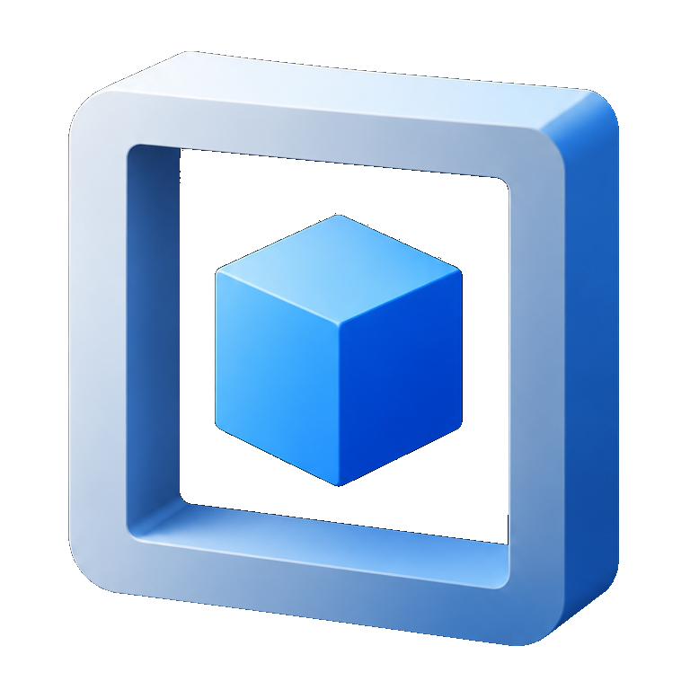

<p align="center">
  
</p>

<h1 align="center">Square</h1>

<p align="center">A lightweight cross platform 3D engine in C++17.</p>

## Overview

Square renders with DirectX 11, OpenGL 4 and Metal from a single set of HLSL shaders, cross compiled by HLSL2ALL. Each driver is a separate library, chosen at run time.

| Area | What it has |
|---|---|
| Rendering | Deferred and forward pipelines, PBR and Legacy (Blinn Phong) materials, cascaded shadows |
| Post effects | SSAO, Bloom, screen space reflections (deferred) |
| Textures | BC1/BC3/BC4/BC5 (DDS) and ASTC 4x4 (KTX) with mipmaps, PNG fallback |
| Scene | Actors and components, worlds and levels, automatic serialization (binary and JSON) |
| Tools | `Model`: glTF/GLB to engine assets (actors, meshes, materials, compressed textures) |

The examples are `HelloWorld`, `HelloWorldCSM` and `Rush`, a small hovercraft racing game.

## Requirements

**Windows**: Visual Studio 2019 or newer, CMake 3.15+, Python 3.6+.

**Linux**:
```bash
sudo apt install build-essential gdb cmake python3 python3-dev python3-pip \
                 libgl1-mesa-dev libglu1-mesa-dev libx11-dev \
                 libxinerama-dev libxcursor-dev libxi-dev libxrandr-dev
```

## Build

Clone with the submodules (glm, zlib, glad, HLSL2ALL, astc-encoder):
```bash
git clone --recursive https://github.com/Gabriele91/square.git
cd square
```
Already cloned? Run `git submodule update --init --recursive`.

Then configure and build:
```bash
mkdir build
cd build
cmake ..
cmake --build .
```
On Windows `cmake ..` generates a Visual Studio solution; `cmake -G Ninja ..` from a VS developer prompt works too.

## Assets

```bat
build\bin\Model.exe -i model.glb -o assets\model -n model -f bgz -r 1024
```
Textures are compressed to BC by default; `-m astc` targets Apple GPUs and mobiles, `-m png` keeps them uncompressed. See [example/Model/README.md](example/Model/README.md).
